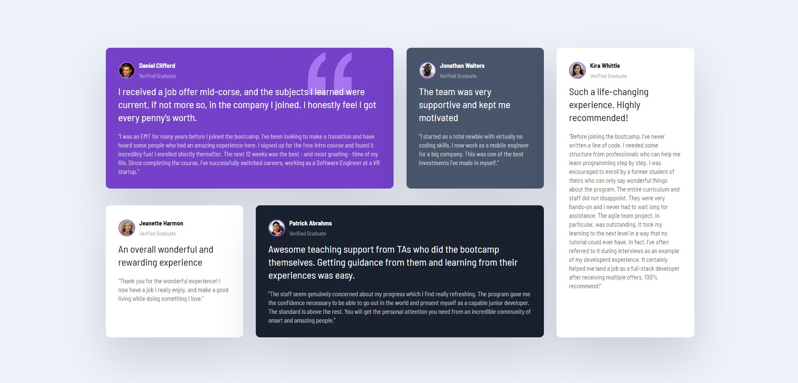
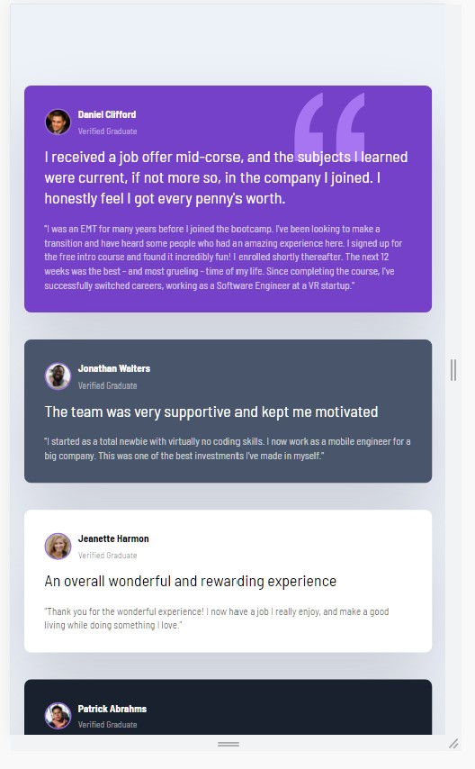

# Frontend Mentor - Testimonials grid section solution

This is a solution to the [Testimonials grid section challenge on Frontend Mentor](https://www.frontendmentor.io/challenges/testimonials-grid-section-Nnw6J7Un7). Frontend Mentor challenges help you improve your coding skills by building realistic projects.

## Table of contents

- [Overview](#overview)
  - [The challenge](#the-challenge)
  - [Screenshot](#screenshot)
  - [Links](#links)
- [My process](#my-process)
  - [Built with](#built-with)
  - [What I learned](#what-i-learned)
  - [Continued development](#continued-development)
  - [Useful resources](#useful-resources)
- [Author](#author)
- [Acknowledgments](#acknowledgments)

**Note: Delete this note and update the table of contents based on what sections you keep.**

## Overview

### The challenge

Users should be able to:

- View the optimal layout for the site depending on their device's screen size

### Screenshot

### Links

- Solution URL: [Add solution URL here](https://your-solution-url.com)
- Live Site URL: [Add live site URL here](https://your-live-site-url.com)

## My process

### Built with

- Semantic HTML5 markup
- CSS custom properties
- Flexbox
- CSS Grid
- Mobile-first workflow

### What I learned

I had trouble initially understanding the concept of CSS grid and how to properly apply it to make this solution to the challenge work. I have a better understanding now of how to properly use grid and to make more complex layouts with it.

### Continued development

Although I gained greater understanding of the concepts I still need alot of practice with them and will continue to gain a greater grasp on the subject.

### Useful resources

- [Traversy Media](https://www.youtube.com/@TraversyMedia) - This helped me with the grid layout and is a go to source of information for me.
- [MDN Web Docs](https://developer.mozilla.org/en-US/) - Recommend getting to know this resource well.

## Author

-
- Frontend Mentor - [MonetCode88](https://www.frontendmentor.io/profile/MonetCode88)
